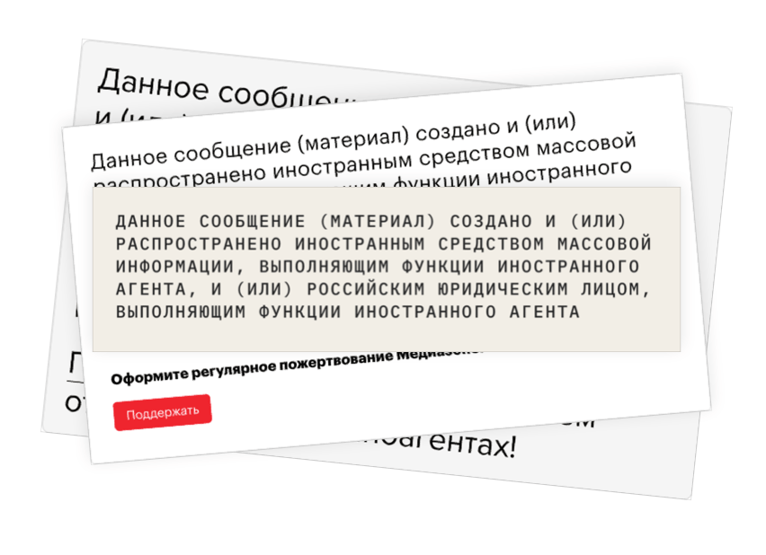

# inoagent

Пользовательский скрипт (userscript), скрывающий плашки об иностранных агентах на сайтах СМИ:

* «Медуза»
* «Дождь»
* «Медиазона»
* «Росбалт»
* «Важные Истории»
* «Первое Антикоррупционное СМИ»
* «Republic»
* Twitter

## Установка

* Установите браузерное расширение для пользовательских скриптов: [Tampermonkey](https://www.tampermonkey.net) или [аналогичное](https://openuserjs.org/about/Userscript-Beginners-HOWTO#how-do-i-get-going-).
* Установите скрипт *inoagent*: https://openuserjs.org/scripts/chev/inoagent.
